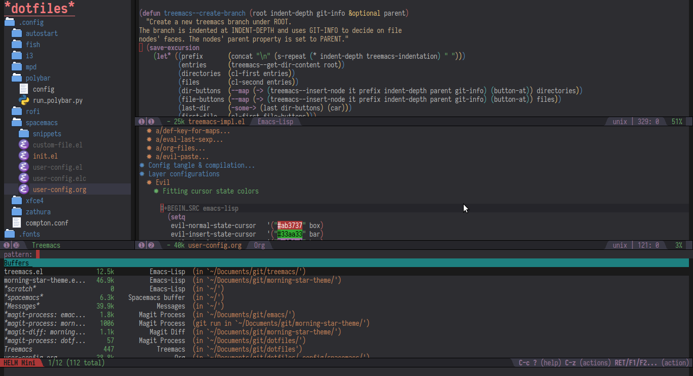

# Morning Star Theme

My own private Emacs color theme, mostly based on Tomorrow Night Eighties:

It's a perpetual work in progress, but so far manages to cover all of my own
use cases. Other than the obligatory builtin bits the folloing modes/packages
are defined (partially meaning some faces are not defined yet because I've yet
to run into them in my day-to-day):

 * ido & ido vertical
 * powerline & spaceline
 * neotree (partially)
 * vimish-fold
 * flycheck
 * smartparens (partially)
 * anzu
 * man-mode
 * custom-mode
 * company-mode
 * dired & dired+
 * rainbow deliiters
 * markdown-mode (partially)
 * ace-window
 * avy
 * org-mode (partially)
 * auctex (partially)
 * undo-tree
 * ansi-term
 * helm (partially)
 * helm-ag
 * helm-swoop
 * magit (partially)
 * git-gutter
 * git-gutter+
 * diff-hl
 * compilation-mode
 * highlight-symbol
 * imenu-list
 * whitespace (partially)
 * which-key
